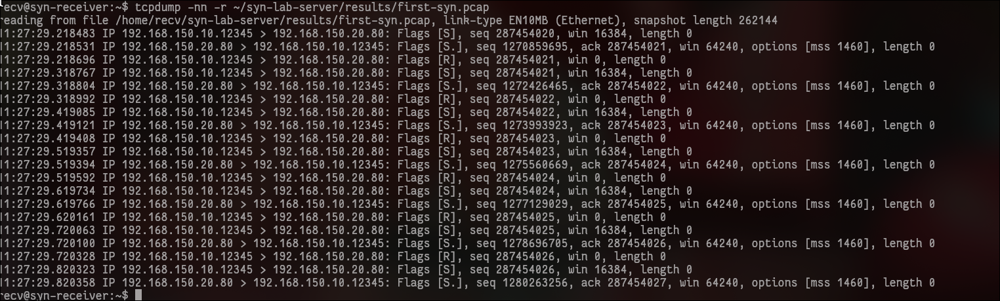

# Reading the First SYN Capture

The sender command was:

```bash
sudo python3 -m client.generator --count 10 --rate 10
```

The generator sent **10 custom SYN packets**. The capture contains more than
those ten packets because the receiver and the sender's Linux kernel also sent
packets.

## Why tcpdump captured 20 packets

The capture filter was:

```bash
'tcp port 80'
```

This means "capture every TCP packet involving port 80 in either direction."
It does not mean "capture only packets created by our generator."

For each custom SYN seen in this capture, three packets were possible:

```text
1. sender   -> receiver    SYN
2. receiver -> sender      SYN-ACK
3. sender   -> receiver    RST
```

The sender's normal Linux TCP stack did not create the custom SYN, so it had no
normal TCP connection matching the returned SYN-ACK. It rejected that
unexpected reply with a reset, or RST.

The capture command also used `-c 20`. This tells tcpdump to stop after **20
matching packets in total**. It is a capture limit, not a statement that the
generator sent 20 packets.

The saved capture contains:

```text
7 custom SYN packets
7 SYN-ACK replies
6 RST packets
-------------------
20 captured packets
```

Tcpdump stopped before the seventh RST became packet 21. The remaining three
custom SYN exchanges happened after the capture had already stopped.

## How to read one SYN line

```text
11:27:29.218483 IP 192.168.150.10.12345 > 192.168.150.20.80: Flags [S], seq 287454020, win 16384, length 0
```

| Part | Meaning |
|---|---|
| `11:27:29.218483` | Time when tcpdump saw the packet. |
| `IP` | This is an IPv4 packet. |
| `192.168.150.10.12345` | Sender IP and source TCP port. |
| `>` | Packet direction. |
| `192.168.150.20.80` | Receiver IP and Nginx TCP port 80. |
| `Flags [S]` | SYN: a request to begin a TCP connection. |
| `seq 287454020` | TCP sequence number selected by our generator. |
| `win 16384` | Advertised TCP receive-window value. |
| `length 0` | No application data was carried. |

## How to read the SYN-ACK reply

```text
192.168.150.20.80 > 192.168.150.10.12345: Flags [S.], seq 1270815965, ack 287454021, win 64240, options [mss 1460], length 0
```

The direction is reversed. The receiver sent `Flags [S.]`, meaning SYN plus
ACK. Its acknowledgement is the sender's sequence number plus one. This proves
that the receiver received the custom SYN and replied to it.

## How to read the reset

```text
192.168.150.10.12345 > 192.168.150.20.80: Flags [R], seq 287454021, win 0, length 0
```

`Flags [R]` means reset. The sender's normal TCP stack rejected the unexpected
SYN-ACK. This clears the half-open connection quickly. Therefore, this first
test proves packet generation and delivery, but it does **not** prove that the
receiver's SYN queue filled.

## TCP flags used here

| Output | Meaning |
|---|---|
| `[S]` | SYN only. |
| `[S.]` | SYN plus ACK. The dot represents ACK. |
| `[R]` | Reset. |
| `[.]` | ACK only. |

## Count each packet type separately

Run these commands on `syn-receiver`.

Count custom SYN packets without counting SYN-ACK replies:

```bash
tcpdump -nn -r ~/syn-lab-server/results/first-syn.pcap 'tcp[13] & 0x12 == 0x02' 2>/dev/null | wc -l
```

Count SYN-ACK replies:

```bash
tcpdump -nn -r ~/syn-lab-server/results/first-syn.pcap 'tcp[13] & 0x12 == 0x12' 2>/dev/null | wc -l
```

Count reset packets:

```bash
tcpdump -nn -r ~/syn-lab-server/results/first-syn.pcap 'tcp[13] & 0x04 != 0' 2>/dev/null | wc -l
```

`tcp[13]` is the byte containing the TCP flags. The hexadecimal masks select
the SYN, ACK, or RST bits. `wc -l` counts the packet lines printed by tcpdump.

## What this test proves

- The custom packet left `syn-sender`.
- It reached `syn-receiver` on TCP port 80.
- The receiver recognized it as a valid SYN and returned a SYN-ACK.
- The sender's normal kernel then returned an RST.

This test does not prove a successful SYN-flood effect. Because the RST packets
clear the half-open connections, the next experiment must account for that
behavior and measure the receiver's TCP state separately.
